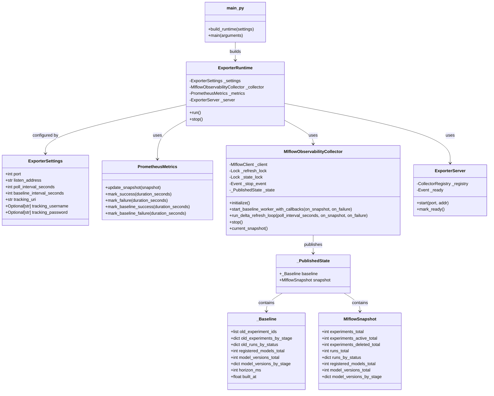
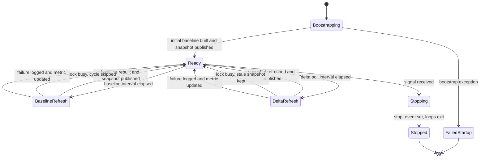
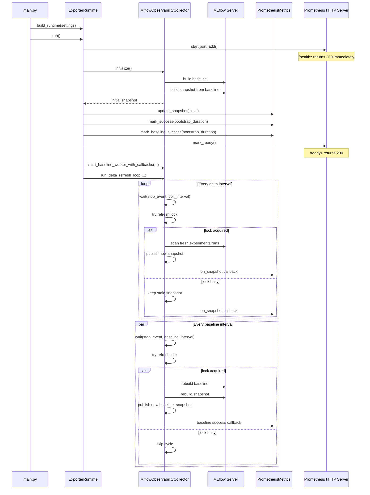

# Architecture

This document describes the runtime architecture of the MLflow Prometheus
Exporter.

## Overview

The exporter is structured around five responsibilities:

- `main.py`: composition root and process entrypoint
- `runtime.py`: application lifecycle and operational coordination
- `collector.py`: MLflow data acquisition, caching, and concurrency control
- `metrics.py`: Prometheus publication and health metrics
- `server.py`: HTTP server with health probes and metrics endpoint

The core design goal is to reduce load on MLflow while keeping the exporter
simple and operationally safe:

- a blocking startup builds an initial `baseline`
- a background baseline worker periodically refreshes stable state
- a frequent delta loop refreshes recent state
- a shared lock prevents unmanaged concurrent refreshes
- stale data is acceptable during contention; partial data is not

## Module Responsibilities

### `mlflow_exporter/main.py`

This is the composition root.

It is responsible for:

- parsing runtime settings
- building the runtime and its dependencies
- installing signal handlers
- delegating shutdown requests to `runtime.stop()`

It is intentionally thin and contains no MLflow polling logic.

### `mlflow_exporter/runtime.py`

This is the application service.

It is responsible for:

- starting the HTTP server (before bootstrap, enabling `/healthz`)
- running the blocking bootstrap
- publishing the first snapshot to Prometheus
- marking baseline and delta health metrics
- marking the server as ready (enabling `/readyz`)
- starting the baseline background worker
- delegating the long-running delta loop to the collector
- stopping collector-owned loops during shutdown

It is the boundary between domain behavior (`collector`) and infrastructure
concerns (`prometheus_client`, `ExporterServer`, process lifecycle).

### `mlflow_exporter/collector.py`

This is the domain core of the exporter.

It is responsible for:

- building a complete `baseline`
- building a `snapshot` from `baseline + delta`
- storing the last published immutable state
- ensuring only one refresh talks to MLflow at a time
- returning stale snapshots during lock contention
- running the baseline worker loop
- running the delta loop

Important internal concepts:

- `_Baseline`: immutable stable state older than the horizon
- `_ExperimentScanResult`: result of scanning experiments (IDs + counts by stage)
- `_ModelVersionScanResult`: result of scanning model versions (total + counts by stage)
- `_PublishedState`: atomically published pair of `baseline + snapshot`
- `_refresh_lock`: serializes MLflow I/O between baseline and delta refreshes
- `_state_lock`: protects publication/retrieval of the current state
- `_stop_event`: coordinated stop signal for long-running loops

### `mlflow_exporter/metrics.py`

This module is a Prometheus adapter.

It is responsible for:

- publishing business metrics from `MlflowSnapshot`
- exposing delta collection health
- exposing baseline rebuild health

It does not know how snapshots are computed.

### `mlflow_exporter/server.py`

This module is the HTTP server.

It is responsible for:

- exposing `/healthz` (always `200`, liveness probe)
- exposing `/readyz` (`503` until bootstrap completes, then `200`)
- exposing `/metrics` (Prometheus exposition format)
- returning `404` for unknown paths

It starts before bootstrap so that liveness checks succeed immediately,
and is marked ready after the initial baseline is published.

## Runtime Flow

### Startup

1. `main()` parses configuration.
2. `main()` builds `ExporterRuntime`.
3. `runtime.run()` starts the HTTP server (`/healthz` available immediately).
4. `runtime.run()` calls `collector.initialize()`.
5. `collector.initialize()` performs a blocking baseline cycle.
6. The first full snapshot is published to Prometheus.
7. The server is marked ready (`/readyz` returns `200`).
8. The baseline worker starts.
9. The collector-owned delta loop starts.

This guarantees that `/healthz` works from the start while `/readyz` and
meaningful `/metrics` data are gated behind a successful bootstrap.

### Baseline Refresh

The baseline worker periodically:

1. waits for the baseline interval
2. tries to acquire the shared refresh lock
3. rebuilds the baseline from MLflow
4. computes a merged snapshot from the new baseline
5. atomically publishes the new state
6. reports success or failure through callbacks

If the delta refresh is already using the lock, the baseline cycle skips that
iteration instead of forcing concurrent MLflow traffic.

### Delta Refresh

The delta loop periodically:

1. waits for the poll interval
2. tries to acquire the shared refresh lock
3. if the lock is busy, returns the current published snapshot
4. otherwise, re-computes the recent-data view from the latest baseline
5. atomically publishes the new snapshot
6. reports success or failure through callbacks

This means the exporter prefers coherent stale data over unsafe concurrency.

## Concurrency Model

The architecture uses two locks and one stop event:

- `_refresh_lock`
  - serializes MLflow I/O
  - shared by baseline and delta refreshes
- `_state_lock`
  - protects the published in-memory state
  - held only briefly during read/write of `_PublishedState`
- `_stop_event`
  - stops baseline and delta loops
  - used for graceful shutdown

Operationally:

- baseline and delta are never allowed to query MLflow concurrently
- readers never see partially published state
- the current snapshot can remain stale if a refresh is delayed or skipped

## Data Model

The exporter distinguishes between:

- `baseline`
  - stable historical view, rebuilt periodically
- `snapshot`
  - exported view currently served to Prometheus
- `delta`
  - not stored as a first-class object
  - computed on demand from the latest baseline and merged immediately

This keeps the state model simple:

- one published baseline
- one published snapshot
- no separate mutable delta cache to reconcile later

## Mermaid Diagrams

### Class Diagram

### State Diagram

### Iteration Diagram

## Current Tradeoffs

The current architecture intentionally prefers simplicity over maximal
incremental sophistication.

Notable tradeoffs:

- stale-but-coherent data is preferred over concurrent refreshes
- baseline and delta share one MLflow I/O lock
- delta is recomputed from the latest baseline instead of stored separately
- correctness around long-lived run status transitions is not yet fully
  optimized; this is the main known architectural limitation

## Production-Oriented Behaviors Already Present

- startup gating before serving `/metrics`
- explicit baseline and delta health metrics
- graceful stop via `runtime.stop()`
- configurable listen address
- Docker healthcheck
- unit, integration, and lint coverage

## Known Architectural Limitation

The main deferred issue is the temporal correctness of run status changes for
runs that started before the baseline horizon and completed later.

